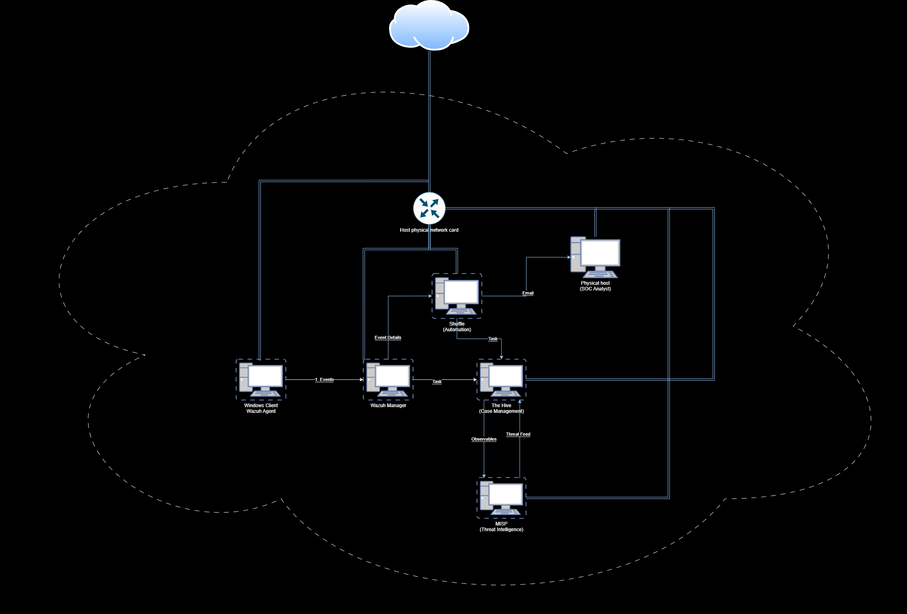

# Overview

## Network

All the machines use the `NAT network` network mode inside of VirtualBox. This allows the malware to be contained in a virtual network such that it does not affect our physical host.

We can learn more about the various networking options inside of VirtualBox from these resources:

* [Virtual Networking](https://www.virtualbox.org/manual/ch06.html)
* [VirtualBox networking - NAT, NAT network, bridged network, internal network, host only network](https://www.youtube.com/watch?v=2Fkf6Kysh7I\&t=461s)

## Architecture

The architecture of the lab is as follows:

<figure><figcaption></figcaption></figure>

## Components

| Machine                         | Component                         | Purpose                                                                                                                                                                                                                                              |
| ------------------------------- | --------------------------------- | ---------------------------------------------------------------------------------------------------------------------------------------------------------------------------------------------------------------------------------------------------- |
| Wazuh ISO (192.168.2.9)         | Wazuh server - SIEM and XDR       | Indexes and stores alerts generated by the Wazuh server and provides near real-time data search and analytics capabilities.                                                                                                                          |
| Windows VM (192.168.2.10)       | Wazuh agent - Endpoint detection  | 
Protects the system by providing threat prevention, detection, and response capabilities. 

Collects different types of system and application data that it forwards to the Wazuh server through an encrypted and authenticated channel.
 |
|                                 | Cortex/MISP - Threat Intelligence |                                                                                                                                                                                                                                                      |
| Ubuntu LTS 22.04 (192.168.2.12) | Shuffle - SOAR platform           | No-code automation platform (SOAR) that lets users automate processes.                                                                                                                                                                               |
| Ubuntu LTS 22.04 (192.168.2.12) | TheHive - Case Management         | Allows SOC analysts to Collaborate, Elaborate and Act on investigations.                                                                                                                                                                             |
