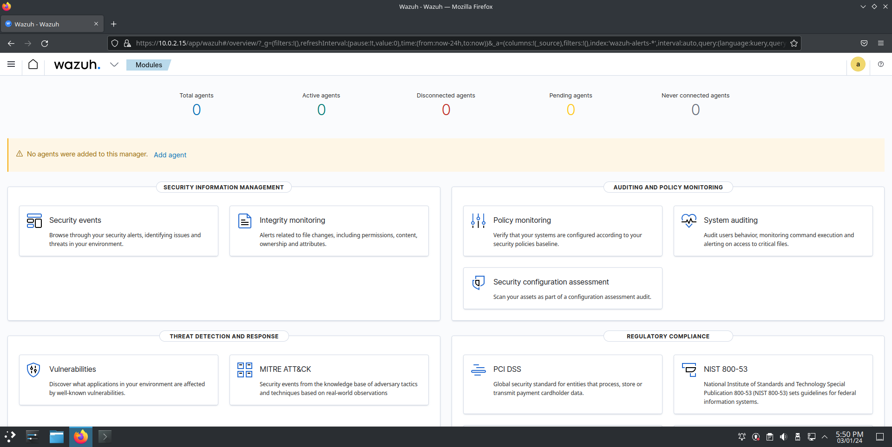
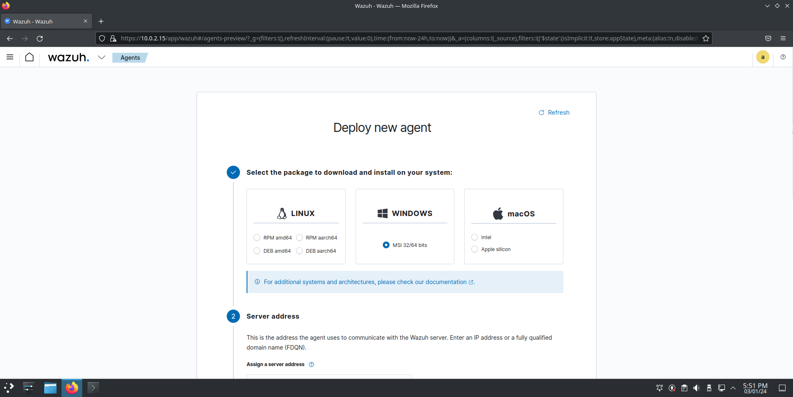

# Wazuh Agent (Windows)

The Wazuh agent is multi-platform and runs on the endpoints that the user wants to monitor. It communicates with the Wazuh server, sending data in near real-time through an encrypted and authenticated channel.


## Installing Wazuh agent on Windows

Once we are logged in to the Wazuh dashboard, we should see something like this:

<figure><figcaption></figcaption></figure>

Click on the `Add agent` option in order to obtain the necessary commands.

<figure><figcaption></figcaption></figure>

We can fill in all the relevant information in this form.

### PowerShell command


```powershell
Invoke-WebRequest -Uri https://packages.wazuh.com/4.x/windows/wazuh-agent-4.6.0-1.msi -OutFile ${env.tmp}\wazuh-agent; msiexec.exe /i ${env.tmp}\wazuh-agent /q WAZUH_MANAGER='<Wazuh manager IP address>' WAZUH_AGENT_NAME='<Agent name>' WAZUH_REGISTRATION_SERVER='<Wazuh manager IP address>'
```


Note that from the above command the `<Wazuh manager IP address>` and `<Agent name>` will be the actual IP address and Agent name that we have set.

### Start the Wazuh agent

```
NET START WazuhSvc
```
