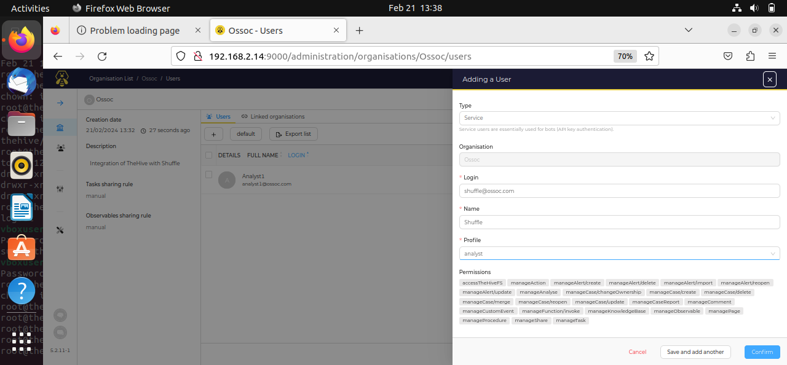
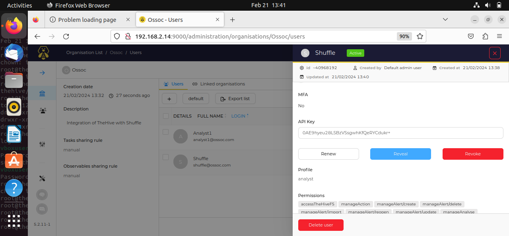

# Integrating with Shuffle

## TheHive

In order to integrate TheHive and Shuffle, you have to create a new user in the existing organization.

<figure><figcaption></figcaption></figure>

Once the user is create, click on the `Preview` button for additional configuration.

Scroll down to the API Key section and click `Create`.

<figure><figcaption></figcaption></figure>

Copy the generated API key.

## Shuffle

In the Shuffle workflow,
