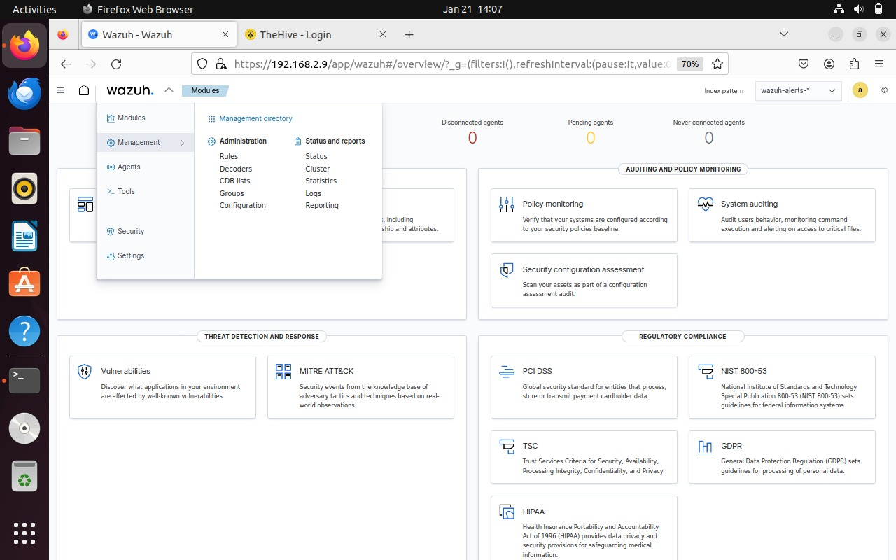
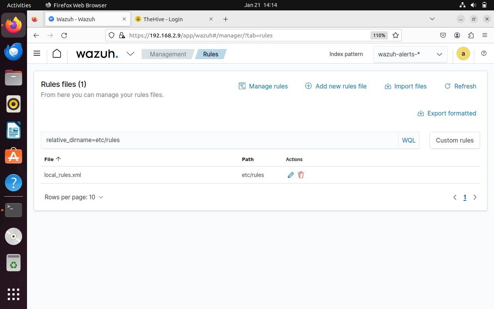

# GUI method

1. Click on the dropdown icon and go into `Management` > `Rules`.

<figure><figcaption></figcaption></figure>

2. Click on the `Manage rules files`.
3. Click on the custom rules button on the left.

<figure><figcaption></figcaption></figure>

4. Open the `local_rules.xml` file and add the rule.
