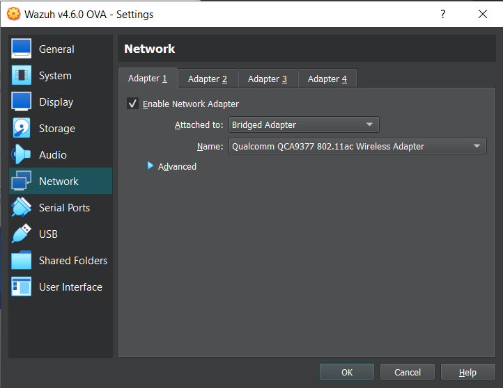
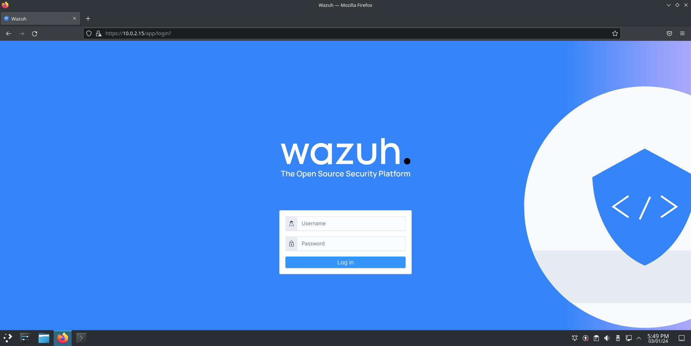

# Setup

## Installation

The Wazuh VM can be downloaded from the following link:



Alternatively we can use the following guide to install all the components step-by-step:

* [Installation guide](https://documentation.wazuh.com/current/installation-guide/index.html)

Once the OVA file is downloaded import it inside if VirtualBox and set the Network Adapter to `Bridged adapter`.

<figure><figcaption></figcaption></figure>


## Dashboard

We can now access the Wazuh Manager's dashboard from any host in the network at:

```
## URI: 
https://(wazuh_server_ip)
```

<figure><figcaption></figcaption></figure>

### Login credentials

| Username | Password |
| -------- | -------- |
| admin    | admin    |
